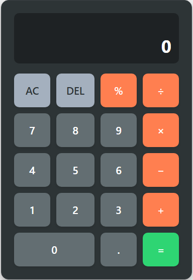

# 🔢 Calculadora Web Simples (calculadora.js)

Uma calculadora funcional e interativa desenvolvida com HTML, CSS e JavaScript puro. Este projeto foi criado como parte do meu aprendizado e portfólio, demonstrando habilidades em desenvolvimento web frontend.

<p align="center">
  
</p>

## ✨ Funcionalidades Principais

* Operações aritméticas básicas: Adição (+), Subtração (-), Multiplicação (\*), Divisão (÷).
* Cálculo de Porcentagem (%).
* Botão para limpar todas as entradas (AC - All Clear).
* Botão para apagar o último dígito inserido (DEL - Delete).
* Interface responsiva e amigável.
* Visor duplo para mostrar a operação anterior/em andamento e o resultado/entrada atual.

## 🛠️ Tecnologias Utilizadas

* **HTML5:** Para a estrutura e semântica da calculadora.
* **CSS3:** Para a estilização visual, layout (usando Flexbox e Grid) e responsividade.
* **JavaScript (ES6+):** Para toda a lógica de funcionamento, manipulação do DOM e cálculos.

## 🚀 Como Executar o Projeto

1.  Clone este repositório:
    ```bash
    git clone [https://github.com/GabMarcon/calculadora.js.git](https://github.com/GabMarcon/calculadora.js.git) 
    ```
2.  Navegue até a pasta do projeto:
    ```bash
    cd calculadora.js
    ```
3.  Abra o arquivo `index.html` no seu navegador de preferência.

E pronto! A calculadora estará funcionando localmente.

## 👤 Autor

* **GabMarcon**
    * GitHub: [@GabMarcon](https://github.com/GabMarcon)
